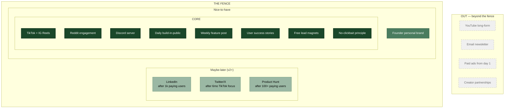

# Certanvil — Launch Social Media Strategy (Scope)

## Scope statement

Certanvil's launch social strategy is a **short-form-vertical-first, community-led, build-in-public play**. Two pillars carry it: TikTok/IG Reels for reach, Reddit + Discord for trust. Daily shipping logs and a weekly feature post set the rhythm; user success stories and free lead magnets convert. The voice rule is non-negotiable — no clickbait, no fake urgency, real numbers only.

**What this is NOT:** not a YouTube channel. Not an email-list play. No paid ads at launch. No creator outreach. Not a founder-brand machine — at least not yet.

---

## Scope buckets

### CORE (must exist)
- TikTok + IG Reels (primary channel)
- Reddit organic engagement (r/CompTIA, r/cybersecurity, r/ITCareerQuestions)
- Discord community server
- Daily build-in-public cadence
- Weekly feature/update post
- User success stories / testimonials
- Free lead magnets (cheat sheets, sample practice questions)
- No clickbait, real numbers only (operating principle)

### NICE-TO-HAVE (v1 polish if time)
- Founder personal brand

### MAYBE-LATER (parked for v2+, with trigger)
- LinkedIn presence → after first 1,000 paying users
- Twitter/X build-in-public → after 6 months of solo TikTok focus
- Product Hunt launch day → after 100+ active paying users

### OUT (explicitly not doing — the fence)
- YouTube long-form
- Email newsletter
- Paid ads from day 1
- Creator/influencer partnerships

---

## Concentric scope diagram

---

## Watch-outs

1. **Core list is production-heavy.** Daily TikTok/Reels + Reddit presence + Discord moderation + weekly feature post + lead-magnet creation = real weekly hours. Without a batching system and a content template, this eats weeknights and competes with the Mum's Care build and Sec+ study. Decide *now* how many hours/week to allocate to social, and protect it like gym time.

2. **No paid ads + no creators + no newsletter = 100% reliant on organic.** Reddit and the TikTok algorithm have to actually work. If weeks 4–8 show weak organic pull, there's no second lever. Watch the funnel hard early; be ready to flip "founder personal brand" from Nice-to-have to Core if reach stalls.

3. **Lead magnets without email is a broken funnel.** Lead magnets are in Core but email newsletter is in Out. Lead magnets only convert if they capture *something* — a Discord auto-DM, a one-time onboarding sequence, a signup form. Either define the capture mechanism, or admit the lead magnet is brand-only and not a conversion tool.
